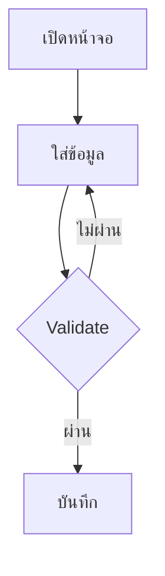

# GCOOP Screen Analysis Methodology

## ภาพรวม
วิธีการวิเคราะห์หน้าจอระบบ GCOOP แบบเป็นระบบ สำหรับการสร้าง knowledge base ที่ครอบคลุมทั้ง C# Web Application, PowerBuilder Integration และ Oracle Database

## เป้าหมาย
สร้างเอกสารวิเคราะห์หน้าจอที่:
- **ครบถ้วน:** ครอบคลุมทั้งฟังก์ชัน business rules และ technical details
- **แม่นยำ:** อิงจากโค้ดจริงเท่านั้น ไม่เดาหรือแต่งเติม
- **สม่ำเสมอ:** ใช้โครงสร้างและรูปแบบเดียวกันทุกหน้าจอ
- **ใช้งานได้:** เป็น knowledge base สำหรับทีมพัฒนาภายใน

## สถาปัตยกรรมที่รองรับ

### Technology Stack
- **Frontend:** ASP.NET Web Forms
- **Framework:** DataSourceTool framework 
- **Database:** Oracle (ADO.NET/ODP.NET)
- **Business Logic:** PowerBuilder Service (.NET) + PowerBuilder Process (Classic)
- **Reports:** iReport 5.0.4

### Integration Patterns
- **PB Service Integration:** `wcf.<Service>.<of_method>(...)`
- **PB Process Integration:** `WebUtil.runProcessing(...)`
- **PB Process Extended:** `WebUtil.runProcessingExtend(...)`

## Methodology Framework

### 1. Scope Definition
**หน้าจอหลัก + หน้าจอย่อย**
- Entry point file (ws_*.aspx) 
- Dialog files (wd_*.aspx) ทั้งหมดใต้ path เดียวกัน
- Code-behind และ related files (.cs, BLL, DAL)
- DataSourceTool configurations

**ขอบเขตความลึก:**
- หน้าจอย่อยไม่เกิน 1 ระดับ
- PowerBuilder integration ตามหลักฐานการเรียกจริง
- ไม่ไล่อ่านหน้าจอหลักตัวอื่น

### 2. Analysis Process

#### Phase 1: File Discovery
```
1. ระบุ entry point file
2. สแกนหน้าจอย่อยทั้งหมด  
3. ติดตาม code-behind chains
4. ค้นหา PowerBuilder integration points
```

#### Phase 2: Code Analysis
```
1. อ่านโค้ด C# ตาม call stack
2. สกัดฟังก์ชันและ business rules
3. ติดตาม PowerBuilder calls
4. แกะ PowerBuilder source code (ถ้าทำได้)
```

#### Phase 3: Documentation
```
1. จัดทำ 10 หัวข้อตามโครงสร้างมาตรฐาน
2. แนบ source code แบบ collapsible
3. สร้าง workflow diagram
4. ตรวจสอบความครบถ้วน
```

### 3. Coding System

#### Function Numbering
- **หน้าจอหลัก:** 1, 2, 3, ...
- **หน้าจอย่อย D{n}:** D1-1, D1-2, D2-1, D2-2, ...
- **PB Service S{n}:** S1-1, S1-2, S2-1, ...
- **PB Process P{n}:** P1-1, P1-2, P2-1, ...

#### Business Rule Numbering
- **หน้าจอหลัก:** BR-01, BR-02, ...
- **หน้าจอย่อย:** BR-D1-01, BR-D2-01, ...
- **PB Service:** BR-S1-01, BR-S2-01, ...
- **PB Process:** BR-P1-01, BR-P2-01, ...

## PowerBuilder Integration Analysis

### การติดตาม PB Service Calls
1. **ค้นหาใน C# code:** `wcf.<Service>.<of_method>(...)`
2. **ระบุ target .sru file** ใน PB Service path
3. **แกะฟังก์ชันจริง** จาก PowerBuilder source
4. **สกัด parameters และ business logic**

### การติดตาม PB Process Calls
1. **ค้นหา process code** ใน `runProcessing*(...)`
2. **หา dispatcher file** ที่มี case ตรงกับ code
3. **ติดตาม object instantiation** และ entry function
4. **อ่าน business logic** ในขอบเขต object เดียวกัน

### PowerBuilder File Handling
**สำหรับไฟล์ .pbl/.sru:**
- ลอง extract UTF-16LE text จาก binary
- ใช้ regex pattern หา PowerScript code
- ตรวจสอบ function signature ให้ตรงกับที่ trace
- ระวัง forward prototypes bug

## Output Structure (10 หัวข้อ)

### 1. ภาพรวมของหน้าจอนี้
- วัตถุประสงค์และบทบาท
- หน้าจอย่อยที่ใช้ทำรายการ (ถ้ามี)

### 2. ลำดับขั้นตอนการทำงาน
- Numbered steps จากเปิดหน้าจอจนงานเสร็จ
- รวมขั้นตอนในหน้าจอย่อย

### 3. แผนภาพขั้นตอน (Mermaid)


### 4. คุณสมบัติและฟังก์ชัน
- รายการฟังก์ชันพร้อมรหัสอ้างอิง
- Source code แบบ collapsible
- อ้างอิงไฟล์และ method

### 5. กฎทางธุรกิจและการตรวจสอบ
- Business rules พร้อมรหัสอ้างอิง  
- สูตรคำนวณ (ข้อความธรรมดา ไม่ใช่ LaTeX)
- Source code แบบ collapsible

### 6-10. หัวข้ออื่นๆ
- สิทธิ์การใช้งาน
- จุดเชื่อมโยงระบบ
- รายงานที่สร้างได้
- ตารางฐานข้อมูล
- ข้อสังเกต/Confidence notes

## Quality Assurance

### Source Code Rules
- **ห้ามแต่งโค้ดขึ้นเอง** - copy จากไฟล์จริงเท่านั้น
- **ตรวจสอบ function signature** ให้ตรงกับที่ trace
- **ระบุแหล่งที่มา** ทุก code snippet
- **แนบแบบ collapsible** ใน section 4-5

### Documentation Standards
- ใช้โครงสร้างตายตัว 10 หัวข้อ
- ตาราง markdown จริงในหัวข้อที่กำหนด
- ห้ามแสดงกระบวนการทำเอกสาร
- Frontmatter ครบถ้วนตาม schema

### PowerBuilder Quality Control
- ตั้ง `needs_human_review: true` เสมอ
- ตรวจคุณภาพโค้ดที่แกะได้
- หลีกเลี่ยง forward prototypes bug
- บันทึกเฉพาะที่ยืนยันได้จริง

## Self-Check Checklist
- [ ] ไม่มี fabricated code ในเอกสาร
- [ ] หัวข้อ 1.1, 6-9 เป็นตาราง markdown
- [ ] links_to/links_from ตรง frontmatter
- [ ] Source code ใน section 4-5 แนบครบ
- [ ] PB integration มี needs_human_review: true
- [ ] Function signature ตรงกับที่ trace
- [ ] ไม่มีสูตร LaTeX ในเอกสาร

## การเชื่อมต่อกับระบบอื่น
- **[[gcoop-mhd]]** - ระบบหลักที่มีหน้าจอต้องวิเคราะห์
- **[[gcoop-pbprocess-systems]]** - PowerBuilder Process ที่เรียกใช้
- **[[gcoop-interest-calculation]]** - Business logic ที่เกี่ยวข้อง
- **[[gcoop-loan-system]]** - ระบบสินเชื่อที่เป็นตัวอย่าง

## ประโยชน์
1. **สำหรับ Developer:** เข้าใจ business logic และ technical flow
2. **สำหรับ Business Analyst:** ตรวจสอบความถูกต้องของ requirements
3. **สำหรับ Maintenance:** เอกสารอ้างอิงสำหรับแก้ไขระบบ
4. **สำหรับ Knowledge Transfer:** ถ่ายทอดความรู้ระหว่างทีม

วิธีการนี้ช่วยให้การวิเคราะห์หน้าจอระบบ GCOOP เป็นไปอย่างเป็นระบบและได้ผลลัพธ์ที่มีคุณภาพสม่ำเสมอ