# ระบบสินเชื่อ — วิเคราะห์ End-to-End Analysis

**วันที่วิเคราะห์:** 2026-09-08
**Path UI:** `/mhd/GCOOP/Saving/Applications/loan/`
**PBProcess Extend:** `/mhd/GCOOP/PBProcess/`
**PBProcess Core:** `/CORE/GCOOP/PBProcess/`
**PBService:** `/CORE/GCOOP/PBService125/`
**Output:** `/CORE/.output/`

---

## 1. ภาพรวมและขอบเขตของระบบ

ระบบสินเชื่อ (Loan System) ของ GCOOP MHD ครอบคลุมกระบวนการตั้งแต่ยื่นคำขอกู้จนถึงปิดบัญชี ประกอบด้วย **33 หน้าจอหลัก** (ws_*) และ **13 child_dialog** (wd_*)

### รูปแบบสถาปัตยกรรมที่พบ

| Pattern | จำนวนหน้าจอ | สัดส่วน |
|---|---|---|
| **WCF-heavy** (wcf.NLoan.* + wcf.NCommon.*) | 14 | 42% |
| **runProcessingExtend** (MHD PBProcess) | 5 | 15% |
| **runProcessing** (Core PBProcess) | 5 | 15% |
| **Direct SQL** (WebUtil.QuerySdt / ExecuteDataSource) | 6 | 18% |
| **Mixed** (WCF + Direct SQL หรือ WCF + runProcessing) | 3 | 9% |

**ข้อสังเกตสำคัญ:** Pattern ไม่สม่ำเสมอ — หน้าจอในกลุ่มเดียวกันบางตัวใช้ WCF บางตัวใช้ Direct SQL โดยไม่มีเหตุผลชัดเจน

---

## 2. ดัชนีหน้าจอทั้งหมด

### กลุ่ม A: คำร้องขอกู้

| ลำดับ | ชื่อหน้าจอ | วัตถุประสงค์ | child_dialog | PB Process/Service | ตารางหลัก | Confidence | Needs Review |
|---|---|---|---|---|---|---|---|
| 1 | ws_lon_reqloan | ยื่นคำขอกู้ปกติ | wd_lon_rightcoll (dlg/), wd_lon_mthoth_minus, wd_lon_mthoth_plus, wd_lon_openloanreq | wcf.NLoan.of_calperiodpay, of_isvalidcoll, of_isvalidcoll2, of_getcollpermiss, of_getcollusecontamt, of_getcollusereqamt, of_getgrplonpermiss, of_computeinterest, of_computeinterest2, of_checkcollmancount; wcf.NCommon.of_getnewdocno, of_getpostingdate, of_getpostingdate2, of_isworkingdate; wcf.Shrlon.of_roundmoney | lnreqloan, lnreqloancoll, lnreqloanclr, lnreqloanclrother, lnloantype, lnloanconstant, lnloantypeperiod, lnloantypecustom, mbmembmaster | High | true |
| 2 | ws_lon_reqloanext | ยื่นคำขอกู้พิเศษ (External) | - | wcf.NLoan.of_calperiodpay, of_calinstallment, of_isvalidcoll, of_getcollpermiss, of_getcollusecontamt, of_getcollusereqamt, of_getgrplonpermiss, of_computeinterest, of_computeinterest2, of_checkcollmancount; wcf.NCommon.of_getnewdocno, of_getpostingdate | lnreqloan, lnreqloancoll, lnreqloanclr, lnreqloanclrother, lnloantype, lnloantypeperiod, lnloantypecustom | High | false |
| 3 | ws_lon_reqloan_adjust_onlne | ปรับปรุงคำขอกู้ Online | - | wcf.NLoan.of_calperiodpay, of_computeinterest, of_getgrplonpermiss; wcf.NCommon.of_getnewdocno, of_getpostingdate, of_getpostingdate2, of_isworkingdate; wcf.Shrlon.of_roundmoney | lnreqloancolladjust, lnreqloanclrotheradjust, lnreqloanclr, lnloantype, lnloantypeperiod, lnloantypecustom | High | false |
| 4 | ws_lon_promise | ทำสัญญา/แก้ไขสัญญา | - | wcf.NLoan.of_getcollpermiss, of_getcollusecontamt, of_getcollusereqamt, of_checkcollmancount | lncontmaster, lncontcoll, lnloantype, lnucfadjustcause | High | true |

### กลุ่ม B: อนุมัติ

| ลำดับ | ชื่อหน้าจอ | วัตถุประสงค์ | child_dialog | PB Process/Service | ตารางหลัก | Confidence | Needs Review |
|---|---|---|---|---|---|---|---|
| 5 | ws_lon_apvloan | อนุมัติคำขอกู้ | - | wcf.NLoan.of_saveapv_lnreq, of_gennewcontractno, of_computeinterest; wcf.NCommon.of_gennewdocnocustom | lnreqloan, lncontmaster | Medium | true |
| 6 | ws_lon_approve_loan | อนุมัติคำขอกู้ (batch) | - | wcf.NLoan.of_saveapv_lnreq, of_gennewcontractno | lnreqloan | Medium | true |
| 7 | ws_lon_cfloantype | ตั้งค่าประเภทเงินกู้ | - | - (Direct SQL) | lnloantype, lnloantypecolluse, lnloantyperightcoll, lnloantypecustom, lncfgrplnperm, lncfloanintrate, lncfintpromotion, lncfsalarybalance, lnucfloanobjective | High | false |

### กลุ่ม C: เบิกจ่าย/รับเงิน

| ลำดับ | ชื่อหน้าจอ | วัตถุประสงค์ | child_dialog | PB Process/Service | ตารางหลัก | Confidence | Needs Review |
|---|---|---|---|---|---|---|---|
| 8 | ws_lon_rcvloan | บันทึกรับเงินกู้ | wd_lon_rcvdetail_ctrl, wd_lon_rcvlon_ctrl, w_dlg_loan_search_receive_ctrl | CoreSavingLibrary.WcfNLoan; iReportBuider | lncontmaster, lnreqloan, lnloanconstant | Medium | true |
| 9 | ws_lon_post_loan_receive | Post รายการรับเงิน (บัญชี) | - | wcf.NLoan.of_saveslip_postlnrcv | lnpostlist_lnrcv (d_lcsrv_postlist_lnrcv.srd), lnloanconstant | Medium | true |
| 10 | ws_lon_post_loan_pxpmp | Post รับเงินกู้ PX/PMP | - | - (Direct SQL) | sltranspayin | High | true |
| 11 | ws_lon_paintloan | พิมพ์เอกสารเงินกู้ | - | WebUtil.runProcessingReport(gid=LOAN_DAILY, rid=LNDY0001) | lncontmaster, lnreqloan | Medium | false |

### กลุ่ม D: ชำระคืน

| ลำดับ | ชื่อหน้าจอ | วัตถุประสงค์ | child_dialog | PB Process/Service | ตารางหลัก | Confidence | Needs Review |
|---|---|---|---|---|---|---|---|
| 12 | ws_lon_payment | บันทึกชำระเงินกู้ | - | wcf.NLoan.of_initslippayin, of_initslippayin_recalint, of_saveslip_payin, of_calfeeloanpayment; wcf.NCommon.of_getnewdocno, of_getnextworkday; wcf.NDeposit.of_withdraw_deposit_trans, of_withdraw_loan; WebUtil.runProcessingFin | lncontmaster, lncffeedet, lncffee, lnloanconstant, slslippayindet | Medium | false |
| 13 | ws_lon_cclpayin | ยกเลิกใบเสร็จชำระ | - | wcf.NLoan.of_saveccl_payin (commented out!) | slslippayindet, slucfslipitemtype | Medium | true |
| 14 | ws_lon_cclpayin_apv | อนุมัติยกเลิกใบเสร็จ | - | wcf.NLoan.of_saveccl_payin | slslippayindet | Medium | false |
| 15 | ws_lon_cclloanrcv_apv | อนุมัติยกเลิกรับเงินกู้ | - | wcf.NLoan.of_saveccl_lnrcv | - | Medium | false |
| 16 | ws_lon_prctrnpayin | Process โอน transaction ชำระ | - | runProcessing("LNPOSTTRNPAYIN") → n_cst_proc_sltrnpayin.of_proc_trnpayin (pcloan.pbl) | lnstm, lncont, lnpayin | Medium | false |
| 17 | ws_lon_prc_preparepay | เตรียมข้อมูลชำระ | - | runProcessing("LNPAYPREPARE") → n_cst_proc_lnprepare.of_proc_lnprepare (pcloan.pbl) | - | Medium | false |

### กลุ่ม E: ค้ำประกัน/หลักทรัพย์

| ลำดับ | ชื่อหน้าจอ | วัตถุประสงค์ | child_dialog | PB Process/Service | ตารางหลัก | Confidence | Needs Review |
|---|---|---|---|---|---|---|---|
| 18 | ws_lon_collateral_master | บันทึกหลักทรัพย์ค้ำประกัน | - | wcf.NCommon.of_getnewdocno | lncollmaster, lncolldetail, lncollmastprop, lncollmastbuilding, lncollmastmemco, lnucfcollmasttypegrp, lnucflandtype, lnucfbuildingtype, lnucfbuildingarea | High | false |
| 19 | ws_lon_collateral_mastdet | ดูรายละเอียดหลักทรัพย์ | - | wcf.NCommon.of_getnewdocno | lncollmaster, lncollmastprop, lncollmastbuilding, lncollmastmemco | High | false |
| 20 | ws_lon_collateral_car | บันทึกหลักทรัพย์รถยนต์ | - | wcf.NCommon.of_getnewdocno | lncollcarmaster | High | false |
| 21 | ws_lon_collredeem | ขอไถ่ถอนหลักทรัพย์ | - | - (Direct SQL) | lncontcoll, lncollmaster, lncolldetail, lncollmastbuilding, lnucfcollredeemcause, lnreqcollmastredeem | High | true |
| 22 | ws_lon_trnsloancoll | โอนสัญญาค้ำประกัน | - | wcf.NLoan.of_savetrn_lntrnres (//pb125) | lncontmaster, lncontcoll, lnloantype | Medium | true |

### กลุ่ม F: กระบวนการ/อื่นๆ

| ลำดับ | ชื่อหน้าจอ | วัตถุประสงค์ | child_dialog | PB Process/Service | ตารางหลัก | Confidence | Needs Review |
|---|---|---|---|---|---|---|---|
| 23 | ws_lon_proc_moneyreturn | Process คืนเงินดอกเบี้ย | - | runProcessingExtend("PROCSETINTRETURNMHD") → of_proc_setmnyreturn_mhd (mhd/pcloan.pbl) | - | Medium | false |
| 24 | ws_lon_proc_paymoneyreturn | Post ใบสำคัญจ่ายคืนดอกเบี้ย | - | runProcessingExtend("POSTINTRETPAYOUT_POSTSTM_SUMPAY") → of_post_toslippayout_sumpay (pcloan.pbl) | - | Medium | true |
| 25 | ws_lon_post_paymoneyreturn | Post รายการคืนดอกเบี้ย | - | runProcessingExtend("POSTINTRETPAYOUT_POSTSTM") → of_post_toslippayout (pcloan.pbl) | - | Medium | false |
| 26 | ws_lon_prcshrlonbal | Process ปรับยอดหุ้น-เงินกู้ | - | runProcessingExtend("SHRLONBAL") → n_cst_proc_slshrlonbal.of_proc_shrlonbal (pcloan.pbl) | - | Medium | false |
| 27 | ws_lon_cls_process_setmb_npl | กำหนดสมาชิก NPL | - | runProcessing("PROCSETARRMTHNPL") → n_cst_sl_mth_arrear_process.of_procnpl (mhd/pcloan.pbl); wcf.NCommon.of_lastdayofmonth | - | Medium | true |
| 28 | ws_lon_caltobank | เครื่องคำนวณเงินกู้ | - | LoanMasterClass.CalPeriodPayment() (C# helper, ไม่ write DB) | - | High | false |
| 29 | ws_lon_reprnmortgage | พิมพ์เอกสารจำนอง | - | iReportBuider → webreportdetail | webreportdetail | High | false |
| 30 | ws_lon_reprntpayout | พิมพ์ใบสำคัญจ่าย | - | iReportBuider | - | High | false |
| 31 | ws_lon_docscan_datatransfer | โอนข้อมูล Document Scan | - | - (ไม่พบ call ใดๆ ใน .cs 114 บรรทัด) | - | Low | true |
| 32 | ws_lon_certificateinterest | หนังสือรับรองดอกเบี้ย | - | runProcessingCappExtend("runPostProcess"); Direct SQL | lnsumintcert, lncontstatement | High | true |
| 33 | ws_imp_post_ctrl | Import + Post transaction | - | runProcessing("LNPOSTTRNPAYIN") → n_cst_proc_sltrnpayin (pcloan.pbl) | - | Medium | false |

---

## 3. แผนภาพการทำงาน

> **หมายเหตุ:** ตรวจสอบโค้ดทุกหน้าจอแล้ว **ไม่พบ screen-to-screen link** (Response.Redirect / Server.Transfer ระหว่าง ws_*) — ทุกหน้าจอเป็น standalone entry point จากเมนู แผนภาพด้านล่างแสดง **data-flow** (หน้าจอกลุ่มใดเขียน/อ่านตารางใด) แทน

```mermaid
flowchart TD
    subgraph A["A: คำร้องขอกู้"]
        A1[ws_lon_reqloan]
        A2[ws_lon_reqloanext]
        A3[ws_lon_reqloan_adjust_onlne]
        A4[ws_lon_promise]
    end

    subgraph B["B: อนุมัติ"]
        B1[ws_lon_apvloan]
        B2[ws_lon_approve_loan]
        B3[ws_lon_cfloantype]
    end

    subgraph C["C: เบิกจ่าย/รับเงิน"]
        C1[ws_lon_rcvloan]
        C2[ws_lon_post_loan_receive]
        C3[ws_lon_post_loan_pxpmp]
        C4[ws_lon_paintloan]
    end

    subgraph D["D: ชำระคืน"]
        D1[ws_lon_payment]
        D2[ws_lon_cclpayin]
        D3[ws_lon_cclpayin_apv]
        D4[ws_lon_cclloanrcv_apv]
        D5[ws_lon_prctrnpayin]
        D6[ws_lon_prc_preparepay]
    end

    subgraph E["E: ค้ำประกัน"]
        E1[ws_lon_collateral_master]
        E2[ws_lon_collateral_mastdet]
        E3[ws_lon_collateral_car]
        E4[ws_lon_collredeem]
        E5[ws_lon_trnsloancoll]
    end

    subgraph F["F: กระบวนการ"]
        F1[ws_lon_proc_moneyreturn]
        F2[ws_lon_proc_paymoneyreturn]
        F3[ws_lon_prcshrlonbal]
        F4[ws_lon_cls_process_setmb_npl]
        F5[ws_lon_certificateinterest]
    end

    T1[(lnreqloan)]
    T2[(lncontmaster)]
    T3[(lncontcoll)]
    T4[(sltranspayin / slslippayindet)]
    T5[(lncollmaster)]
    T6[(lnsumintcert)]

    A1 & A2 & A3 -->|write| T1
    A4 -->|read lncontmaster / write lncontcoll| T2
    B1 & B2 -->|read lnreqloan / write lncontmaster| T1
    B1 & B2 -->|write| T2
    C1 -->|read| T2
    C2 & C3 -->|write| T4
    D1 & D3 -->|write slslippayindet| T4
    D5 -->|write lnstm/lncont| T2
    E1 & E2 & E3 -->|write| T5
    E4 & E5 -->|read/write lncontcoll| T3
    F5 -->|write| T6
```



---

## 4. กระบวนการทำงานหลักของระบบ

ระบบสินเชื่อทำงานตาม **6 กลุ่มหลัก** ต่อเนื่องกันผ่าน data (ไม่ใช่ screen navigation):

```
[A] ยื่นคำร้อง → lnreqloan (WCF-heavy: NLoan, NCommon)
        ↓
[B] อนุมัติ → lncontmaster เกิดขึ้น (wcf.NLoan.of_saveapv_lnreq)
        ↓
[E] ค้ำประกัน → lncollmaster, lncontcoll (Direct SQL + wcf.NCommon)
        ↓
[C] เบิกจ่าย → sltranspayin, slslippayout (WCF + Direct SQL)
        ↓
[D] ชำระคืน → slslippayindet, lnstm (WCF + runProcessing)
        ↓
[F] กระบวนการปิด → lnsumintcert (runProcessingExtend + Direct SQL)
```

**จุดพิเศษที่พบ:**
- `ws_lon_caltobank` ไม่ write DB เลย — เป็นแค่ calculator ฝั่ง UI
- `ws_lon_cls_process_setmb_npl` มี `LNCLOSEMONTH` commented out — ใช้แค่ `PROCSETARRMTHNPL` จริง
- MHD มี `PROCSETINTRETURNMHD` เป็น extend process เฉพาะ ไม่มีใน core

**สัดส่วนสถาปัตยกรรม:**
WCF 42% > Direct SQL 18% > runProcessingExtend 15% = runProcessing 15% > Mixed 9%

---

## 5. ตารางข้อมูลที่ใช้

| ชื่อตาราง | ใช้ในหน้าจอ |
|---|---|
| **lnreqloan** | ws_lon_reqloan, ws_lon_reqloanext, ws_lon_reqloan_adjust_onlne, ws_lon_apvloan, ws_lon_approve_loan, ws_lon_rcvloan |
| **lncontmaster** | ws_lon_promise, ws_lon_apvloan, ws_lon_approve_loan, ws_lon_rcvloan, ws_lon_trnsloancoll, ws_lon_paintloan, ws_lon_prctrnpayin |
| **lncontcoll** | ws_lon_promise, ws_lon_collredeem, ws_lon_trnsloancoll |
| **lnloantype + ตารางลูก ~13 ตาราง** | ws_lon_reqloan, ws_lon_reqloanext, ws_lon_reqloan_adjust_onlne, ws_lon_cfloantype, ws_lon_promise, ws_lon_trnsloancoll |
| **lncollmaster / lncolldetail / lncollmastprop / lncollmastbuilding** | ws_lon_collateral_master, ws_lon_collateral_mastdet, ws_lon_collredeem |
| **lncollcarmaster** | ws_lon_collateral_car |
| **lnreqcollmastredeem** | ws_lon_collredeem |
| **sltranspayin** | ws_lon_post_loan_pxpmp |
| **slslippayindet / slslippayin** | ws_lon_cclpayin, ws_lon_cclpayin_apv, ws_lon_payment |
| **lnsumintcert / lncontstatement** | ws_lon_certificateinterest |
| **mbmembmaster** | ws_lon_reqloan (ผ่าน wcf.NLoan.of_isvalidcoll) |
| **webreportdetail** | ws_lon_reprnmortgage |
| **lnloanconstant** | ws_lon_payment, ws_lon_rcvloan, ws_lon_post_loan_receive |

---

## 6. จุดที่ต้องให้ Business User ยืนยัน

| หน้าจอต้นทาง | ประเด็นที่ต้องยืนยัน |
|---|---|
| ws_lon_reqloan | Hardcode "อายุสมาชิกผู้ค้ำต้องมีอายุไม่น้อยกว่า 72 เดือน (6 ปี)" — ตัวเลขนี้ hardcode หรือดึงจาก config? |
| ws_lon_reqloan | Hardcode เงื่อนไข "เงินกู้ประเภทสามัญอาวุโส ยอดขอกู้ ต้องหลักพัน หรือ 500" — มาจาก lnloantype config หรือ hardcode? |
| ws_lon_reqloan | exe.AddFormView (Insert/Update) — มี transaction ครอบหรือไม่? ถ้า insert lnreqloan สำเร็จแต่ insert lnreqloancoll ล้มเหลว จะ rollback ได้ไหม? |
| ws_lon_reqloan | OpenIFrame2 (commented out) ใช้ OpenIFrame2Extend แทน — ยืนยัน wd_lon_rightcoll.aspx อยู่ที่ path จริงใด (ไม่พบใน dlg/) |
| ws_lon_promise | DELETE lncontcoll ก่อน INSERT ใหม่ (line 769-776) ไม่มี transaction ครอบชัดเจน — risk data integrity |
| ws_lon_apvloan / ws_lon_approve_loan | wcf.NLoan.of_saveapv_lnreq — ไม่พบ implementation ใน core/lncoopsrv.pbl อยู่ที่ไหน? |
| ws_lon_rcvloan | Report hardcode "ir_receipt_a4_lon2p_mhd_new" — ใช้ template เดียวทุกกรณีหรือไม่? |
| ws_lon_post_loan_pxpmp | INSERT INTO sltranspayin ต่อ loop แต่ละ row ด้วย exe.Execute() ครั้งเดียว — ถ้า row N ล้มเหลว rows ก่อนหน้า rollback ไหม? |
| ws_lon_post_loan_pxpmp | Hardcode sliptype_code='PX', trnsource_code='DFP', trnsource_status=8, moneytype_code='TRD' — ค่าเหล่านี้มีนัยสำคัญทางบัญชีอย่างไร? |
| ws_lon_cclpayin | wcf.NLoan.of_saveccl_payin ถูก comment out (line 110) — การยกเลิกใบเสร็จทำงานอย่างไร? |
| ws_lon_cls_process_setmb_npl | LNCLOSEMONTH ถูก comment — ปิดชั่วคราวหรือถาวร? |
| ws_lon_certificateinterest | DELETE lnsumintcert ทั้ง year แล้ว INSERT ใหม่ — ถ้า INSERT ล้มเหลวจะเกิดข้อมูลสูญหาย |
| ws_lon_caltobank | Hardcode interest_rate = 5.25 — ควรดึงจาก config ไหม? |
| ws_lon_trnsloancoll | wcf.NLoan.of_savetrn_lntrnres (comment: //pb125) — version compatibility กับ PB 12.5 เท่านั้นไหม? |
| ws_lon_collredeem | INSERT lnreqcollmastredeem — การไถ่ถอนต้องผ่านขั้นตอนอนุมัติหรือ execute ทันที? |
| ws_lon_docscan_datatransfer | ไม่พบ business logic ใดๆ ใน .cs 114 บรรทัด — หน้าจอนี้ทำงานจริงหรือไม่? |

---

## 7. ข้อสังเกตความไม่สอดคล้องระหว่างหน้าจอ

### 7.1 Pattern สถาปัตยกรรมไม่สม่ำเสมอในกลุ่มเดียวกัน
- **กลุ่มเบิกจ่าย:** ws_lon_post_loan_receive ใช้ WCF แต่ ws_lon_post_loan_pxpmp ใช้ Direct SQL — ทำงานคล้ายกันแต่ implement ต่างกันโดยสิ้นเชิง
- **กลุ่มชำระคืน:** ws_lon_payment ใช้ WCF + runProcessingFin แต่ ws_lon_prctrnpayin ใช้ runProcessing(LNPOSTTRNPAYIN) — ทั้งสองทำ post รายการชำระแต่คนละ path

### 7.2 Dead Code ที่พบ
| ไฟล์ | Dead Code |
|---|---|
| ws_lon_reqloan.aspx.cs line 2021 | `//Gcoop.OpenIFrame2(...)` — commented, ใช้ OpenIFrame2Extend แทน |
| ws_lon_cclpayin.aspx.cs line 110 | `// int result = loanService.of_saveccl_payin(...)` — save call หลักถูก comment |
| ws_lon_cls_process_setmb_npl.aspx.cs line 78 | `//runProcessing("LNCLOSEMONTH", ...)` — commented |
| ws_lon_proc_paymoneyreturn.aspx.cs lines 59-60 | `//POSTINTRETPAYOUTEGAT` สองบรรทัด — commented |

### 7.3 wcf.NLoan.of_saveapv_lnreq — Implementation ไม่พบ
ถูกเรียกใน 2 หน้าจอ (ws_lon_apvloan, ws_lon_approve_loan) แต่ไม่พบ implementation ใน core/lncoopsrv.pbl ทุกไฟล์ — น่าจะอยู่ใน SWU extension หรือ MHD-specific PBService ที่ไม่ได้ checkout

### 7.4 MHD PBProcess มี process ที่ Core ไม่มี
| Process | อยู่ใน MHD | อยู่ใน Core |
|---|---|---|
| PROCSETINTRETURNMHD | ✅ | ❌ |
| PROCSETARRMTHNPL | ✅ | ❌ (Core มี TARRMTHNPL แทน) |
| SHRLONBAL | ✅ | ✅ |

### 7.5 wd_lon_rightcoll.aspx — Path ไม่ตรง
ws_lon_reqloan.aspx.cs line 2023 อ้างถึง `wd_lon_rightcoll.aspx` แต่ไม่พบโฟลเดอร์นี้ใน `dlg/` ของ loan — อาจอยู่ path อื่นหรือเป็น dead path

### 7.6 ws_lon_docscan_datatransfer — หน้าจอ Empty
.cs ขนาด 114 บรรทัด แต่ไม่พบ runProcessing / wcf / INSERT / UPDATE ใดๆ — หน้าจออาจทำงานผ่าน base class หรือ JavaScript ที่ไม่อยู่ใน source นี้ ต้องตรวจสอบเพิ่มเติม
