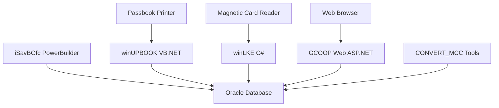

# MCC Session 3: Infrastructure Analysis

**วิเคราะห์เครื่องมือและโครงสร้างพื้นฐาน MCC System Infrastructure Tools**

*Document Version: 1.0*  
*Created: 2024-12-19*  
*Last Updated: 2024-12-19*

## สารบัญ (Table of Contents)

1. [ภาพรวมระบบ MCC](#ภาพรวมระบบ-mcc)
2. [iSavBOfc - PowerBuilder Banking Application](#isavbofc---powerbuilder-banking-application)
3. [winUPBOOK - Passbook Update Tool](#winupbook---passbook-update-tool)  
4. [winLKE - Magnetic Reader Interface](#winlke---magnetic-reader-interface)
5. [CONVERT_MCC - Data Migration Tools](#convert_mcc---data-migration-tools)
6. [C# Tools และ Utilities](#c-tools-และ-utilities)
7. [สถาปัตยกรรมระบบ](#สถาปัตยกรรมระบบ)
8. [บทสรุปและข้อเสนอแนะ](#บทสรุปและข้อเสนอแนะ)

---

## ภาพรวมระบบ MCC

MCC (Member Cooperative Center) เป็นระบบสหกรณ์ออมทรัพย์ที่ประกอบด้วยเครื่องมือหลายตัวทำงานร่วมกัน:

### โครงสร้างไดเรกทอรี
```
/root/gcoop_hermes/mcc/
├── iSavBOfc/           # PowerBuilder Banking Core
├── winUPBOOK/         # VB.NET Passbook Update Tool  
├── winLKE/            # C# Magnetic Card Reader
├── CONVERT_MCC/       # Data Migration & Conversion
└── GCOOP/             # Web Application Framework
```

### เทคโนโลยีหลัก
- **PowerBuilder Classic** - ระบบหลักแบบ Client/Server
- **C# .NET Framework 4.6.1** - Desktop Applications
- **VB.NET** - Passbook Utilities
- **ASP.NET Web Forms** - Web Interface
- **Oracle Database** - ฐานข้อมูลหลัก

---

## iSavBOfc - PowerBuilder Banking Application

### ข้อมูลเบื้องต้น
- **ประเภท**: PowerBuilder Classic Application
- **ไฟล์หลัก**: `isavbofc.pbw`, `isavbofc.exe`
- **วัตถุประสงค์**: ระบบหลักสหกรณ์ออมทรัพย์

### โครงสร้างไฟล์
```
iSavBOfc/
├── isavbofc.pbw        # PowerBuilder Workspace
├── isavbofc.exe        # Main Application
├── iBank/              # Target Directory  
├── sBussCom/          # Business Component Libraries
│   ├── cmsrv_loan.pbl      # Loan Services
│   ├── cmsrv_fin.pbl       # Financial Services  
│   ├── cmsrv_dept.pbl      # Department Services
│   └── cmsrv_mbshr.pbl     # Member Share Services
└── [PowerBuilder Runtime DLLs]
```

### PowerBuilder Runtime Libraries
- **PBVM125.DLL** - PowerBuilder Virtual Machine
- **PBODB125.DLL** - Database Connectivity
- **PBSQL125.DLL** - SQL Interface
- **PBDWM125.DLL** - DataWindow Manager
- **PBWZP125.DLL** - Web Services

### Business Components
1. **cmsrv_loan.pbl** - การจัดการสินเชื่อ
2. **cmsrv_fin.pbl** - การเงินและบัญชี  
3. **cmsrv_dept.pbl** - การจัดการฝากเงิน
4. **cmsrv_mbshr.pbl** - การจัดการหุ้นสมาชิก
5. **pccomloan.pbl** - Loan Communication

### คุณสมบัติหลัก
- ระบบสมาชิกสหกรณ์
- การจัดการบัญชีฝากเงิน
- ระบบสินเชื่อ
- การจัดการหุ้น
- รายงานทางการเงิน

---

## winUPBOOK - Passbook Update Tool

### ข้อมูลเบื้องต้น
- **ประเภท**: VB.NET Windows Application  
- **เวอร์ชัน**: Visual Studio 2010
- **Platform Target**: x86 (32-bit)
- **วัตถุประสงค์**: อัปเดตข้อมูลในสมุดคู่ฝาก

### โครงสร้างโปรเจ็กต์
```
winUPBOOK/
├── winUPBOOK.sln           # Solution File
├── winUPBOOK/
│   ├── Form1.vb            # Main Form  
│   ├── UpdateBook.vb       # Update Logic
│   ├── Connection.vb       # Database Connection
│   ├── Data.vb             # Data Management
│   └── My Project/         # Project Settings
└── pbUpbook/              # ClickOnce Deployment
```

### คุณสมบัติหลัก (จากการวิเคราะห์ Form1.vb)
1. **การเชื่อมต่อฐานข้อมูล Oracle**
   ```vb
   Imports Oracle.DataAccess.Client
   Dim oracleconn As New OracleConnection
   ```

2. **การจัดการเครื่องพิมพ์สมุดคู่ฝาก**
   ```vb
   Private Sub PrnBook(ByVal acno As String)
   rc = AxPEM1.GetPageNumber(pageNumber)
   ```

3. **ระบบ Logging และ Error Handling**
   ```vb
   InsertLog(acno, "can not get page number")
   Log(acno & "pageNumber=" & pageNumber)
   ```

### Dependencies
- Oracle Data Access Components (ODAC)
- Passbook Printer OCX Control (AxPEM1)
- .NET Framework Runtime

---

## winLKE - Magnetic Reader Interface  

### ข้อมูลเบื้องต้น
- **ประเภท**: C# Windows Forms Application
- **Framework**: .NET Framework 4.6.1
- **Platform**: AnyCPU
- **วัตถุประสงค์**: อินเทอร์เฟซสำหรับอ่านข้อมูลจากบัตรแม่เหล็ก

### โครงสร้างโปรเจ็กต์
```
winLKE/
└── winMagneticBook/
    ├── winMagneticBook.sln     # Solution File
    └── winMagneticBook/
        ├── Form1.cs            # Main Form
        ├── Program.cs          # Entry Point
        ├── winLKE.exe         # Compiled Output
        └── Drivers/           # Device Drivers
```

### คุณสมบัติหลัก (จากการวิเคราะห์ Form1.cs)

1. **Windows API Integration**
   ```csharp
   [DllImport("user32.dll")]
   private static extern bool ShowWindow(IntPtr hWnd, ShowWindowEnum flags);
   
   [DllImport("user32.dll", SetLastError = true)]
   internal static extern IntPtr FindWindow(string lpClassName, string lpWindowName);
   ```

2. **Process Management**
   ```csharp
   Process bProcess;
   String processName = "C:\\GCOOP_ALL\\AERO\\winLKE\\Drivers\\winLKEAppDevices\\winLKE.exe";
   
   public void BringMainWindowToFront(string processName)
   ```

3. **Oracle Database Connectivity**
   ```csharp
   using Oracle.DataAccess.Client;
   ```

### การทำงาน
- อ่านข้อมูลจากบัตรแม่เหล็ก
- จัดการ Window Focus และ Process
- เชื่อมต่อกับฐานข้อมูล Oracle
- ส่งข้อมูลไปยังระบบหลัก

---

## CONVERT_MCC - Data Migration Tools

### ข้อมูลเบื้องต้น
- **ประเภท**: PowerBuilder Data Migration Suite
- **วัตถุประสงค์**: แปลงและย้ายข้อมูลระหว่างระบบ

### โครงสร้างเครื่องมือ
```
CONVERT_MCC/
├── mcc_pipeline/          # Pipeline Conversion Tools
│   ├── mcc_workspace.pbw      # Main Workspace
│   ├── mcc_pipe.pbt           # Target File
│   ├── mcc_pipe_member.pbl    # Member Data Pipeline
│   ├── mcc_pipe_dep.pbl       # Deposit Pipeline  
│   ├── mcc_pipe_shrlon.pbl    # Share/Loan Pipeline
│   └── mcc_pipe_insurance.pbl # Insurance Pipeline
├── cnv_addr/             # Address Conversion
│   ├── cnvaddr.pbw           # Address Workspace
│   └── cnvaddr.pbl           # Address Library
└── SQL Scripts/          # Database Scripts
```

### SQL Scripts และไฟล์แปลง
1. **Delete Data.txt** - สคริปต์ลบข้อมูล
   ```sql
   --DEPT (Deposit)
   delete from DPDEPTSTATEMENT;
   delete from DPDEPTMASTER;
   
   --LOAN  
   delete from LNCONTSTATEMENT;
   delete from LNCONTMASTER;
   
   --MEMBER SHARE
   delete from SHSHARESTATEMENT;
   ```

2. **mapkepitem.sql** - แมปข้อมูลสินค้าค้ำประกัน
3. **maplonitem.sql** - แมปข้อมูลสินเชื่อ  
4. **mapshritem.sql** - แมปข้อมูลหุ้น
5. **sql_update_loan_reqlaon.sql** - อัปเดตข้อมูลคำขอสินเชื่อ

### Pipeline Modules
- **mcc_pipe_member.pbl** - แปลงข้อมูลสมาชิก
- **mcc_pipe_dep.pbl** - แปลงข้อมูลเงินฝาก
- **mcc_pipe_shrlon.pbl** - แปลงข้อมูลหุ้นและสินเชื่อ  
- **mcc_pipe_divavg.pbl** - คำนวณเงินปันผล
- **mcc_pipe_insurance.pbl** - แปลงข้อมูลประกันภัย
- **mcc_pipe_keeping.pbl** - แปลงข้อมูลการรับฝาก

---

## C# Tools และ Utilities

### GCOOP Web Application Framework

**โครงสร้างโซลูชัน:**
```
GCOOP/
├── GCOOP_MCC.sln              # Main Solution
├── Saving/                    # Web Application
│   ├── Extend_Saving.csproj       # Main Web Project
│   ├── ApplicationSelectionPage.aspx.cs
│   ├── CustomControl/             # User Controls
│   ├── CriteriaIReport/          # Report Criteria  
│   └── SlipPB/                   # Slip Printing
├── Renci.SshNet/             # SSH Library
└── Dependencies/             # Core Libraries
```

### Core Libraries และ Dependencies
1. **Lib_DataLibrary.csproj** - ไลบรารีการจัดการข้อมูล
2. **Lib_EncryptDecryptEngine.csproj** - การเข้ารหัส/ถอดรหัส
3. **Lib_CoreGcoopServiceCs.csproj** - บริการหลัก GCOOP
4. **Core_Saving.csproj** - โมดูลการออมทรัพย์
5. **Core_SingleSignOn.csproj** - ระบบ SSO
6. **Lib_CoreSavingLibrary.csproj** - ไลบรารีออมทรัพย์
7. **Lib_CoreWebServiceLibrary.csproj** - Web Service Library

### เครื่องมือเสริม (Utility Tools)
```
GCOOP/
├── PBReport125/
│   └── pbreport.exe          # PowerBuilder Report Generator
├── PLSQL/  
│   └── PLImporter.exe        # PL/SQL Import Tool
├── XMLConfig/
│   └── xmlconfig.exe         # XML Configuration Tool
└── PBProcess/
    └── pbprocess.exe         # PowerBuilder Process Tool
```

### Custom Controls และ Components
1. **DatePicker.ascx** - ควบคุมการเลือกวันที่
2. **MenuBarControl.ascx** - แถบเมนูหลัก  
3. **TopBarControl.ascx** - แถบด้านบน
4. **MenuSubControl.ascx** - เมนูย่อย

### การจัดการรายงาน (Report Management)
- **CriteriaIReport/** - เกณฑ์การออกรายงาน
- **u_cri_coopid_date** - เกณฑ์วันที่ตามสหกรณ์
- **u_cri_coopid_memno_loancont** - เกณฑ์สมาชิกและสัญญา
- **uc_coopid_rdate_rloantype_status** - เกณฑ์ประเภทสินเชื่อ

---

## สถาปัตยกรรมระบบ

### การเชื่อมต่อระหว่างระบบ



### การไหลของข้อมูล (Data Flow)
1. **Input Sources**
   - iSavBOfc (การทำธุรกรรมหลัก)
   - winLKE (อ่านบัตรแม่เหล็ก)  
   - GCOOP Web (อินเทอร์เฟซเว็บ)

2. **Processing Layer**
   - PowerBuilder Business Logic
   - C# Desktop Applications
   - ASP.NET Web Services

3. **Output Destinations**  
   - Oracle Database (ข้อมูลหลัก)
   - Passbook Printer (สมุดคู่ฝาก)
   - Web Reports (รายงานเว็บ)

### Platform Requirements
- **Operating System**: Windows (32-bit IIS Application Pool)
- **Database**: Oracle Database + ODAC
- **Runtime**: .NET Framework 4.6.1, PowerBuilder Runtime
- **Hardware**: Passbook Printer, Magnetic Card Reader

---

## บทสรุปและข้อเสนอแนะ

### จุดแข็งของระบบ
1. **ครอบคลุม**: มีเครื่องมือครอบคลุมทุกกระบวนการ
2. **Integration**: ระบบเชื่อมต่อกันผ่าน Oracle Database
3. **Specialized Tools**: เครื่องมือเฉพาะสำหรับแต่ละงาน
4. **Migration Support**: มีเครื่องมือแปลงข้อมูลครบชุด

### จุดที่ควรปรับปรุง
1. **Technology Stack**: 
   - PowerBuilder Classic ล้าสมัย ควรพิจารณาย้ายไป .NET
   - VB.NET ควรเปลี่ยนเป็น C# เพื่อความสอดคล้อง

2. **Architecture Modernization**:
   - ควรพัฒนา Web API เพื่อ Integration ที่ดีขึ้น
   - พิจารณาใช้ Microservices Architecture

3. **Security Enhancement**:
   - เพิ่มการเข้ารหัสข้อมูล end-to-end  
   - ปรับปรุงระบบ Authentication/Authorization

4. **Performance Optimization**:
   - ใช้ Connection Pooling
   - Cache Management
   - Database Query Optimization

### ข้อเสนอแนะการพัฒนา
1. **Phase 1**: ปรับปรุง GCOOP Web เป็น ASP.NET Core
2. **Phase 2**: พัฒนา REST API สำหรับ Integration
3. **Phase 3**: Migrate PowerBuilder เป็น C# WinForms/WPF  
4. **Phase 4**: ปรับปรุงฐานข้อมูลและ Performance

### เครื่องมือที่แนะนำ
- **Development**: Visual Studio 2022, Oracle Developer Tools
- **Database**: Oracle SQL Developer, Toad for Oracle  
- **Version Control**: Git, TFS
- **Testing**: NUnit, Oracle SQL Test
- **Deployment**: ClickOnce, IIS Manager

---

*หมายเหตุ: เอกสารนี้จัดทำขึ้นจากการวิเคราะห์โครงสร้างไฟล์และ source code ที่มีอยู่ในระบบ MCC ณ วันที่ 19 ธันวาคม 2024*