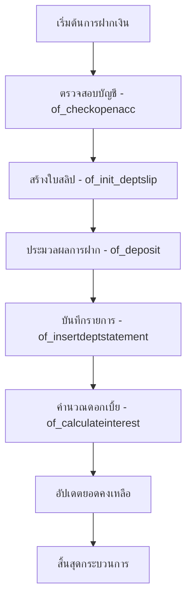
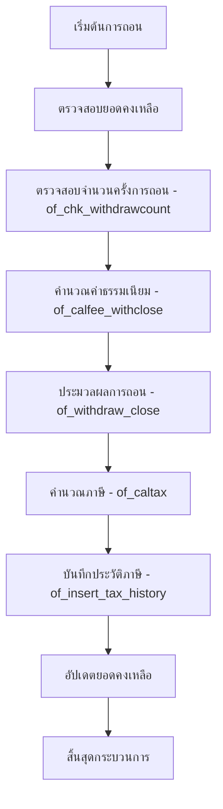
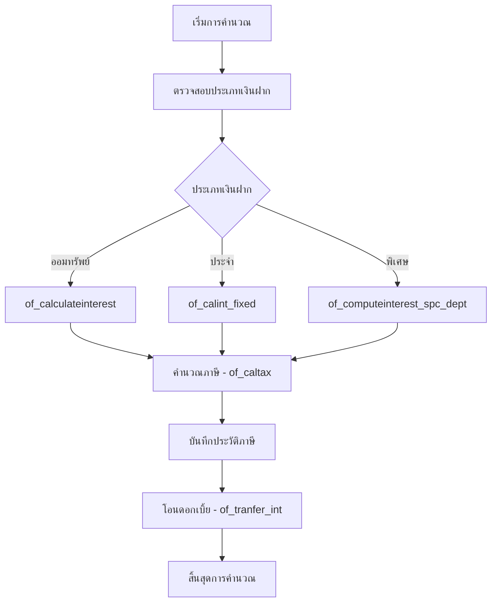

# การวิเคราะห์ระบบเงินฝาก/ออมทรัพย์ - pcdeposit.pbl

## ข้อมูลทั่วไป

**ไฟล์:** pcdeposit.pbl  
**ขนาด:** 11.4 MB (11,904,000 bytes) - ไฟล์ใหญ่อันดับ 2 ในระบบ  
**ประเภท:** PowerBuilder Library (PBL)  
**ระบบงาน:** เงินฝาก/ออมทรัพย์ (Deposit & Savings System)  
**ที่ตั้งไฟล์:** `/root/gcoop_hermes/mhd/GCOOP/PBProcess/pcdeposit.pbl`  

## ภาพรวมระบบ

ระบบเงินฝาก/ออมทรัพย์ (pcdeposit.pbl) เป็นหนึ่งในระบบหลักของสหกรณ์ออมทรัพย์ ครอบคลุมการทำงานด้านการเงินที่สำคัญทั้งหมด ตั้งแต่การฝากเงิน การถอนเงิน การคำนวณดอกเบิ้ย ไปจนถึงการจัดการบัญชีและการรายงาน

### สถิติองค์ประกอบ
- **ฟังก์ชันทั้งหมด:** 84 functions
- **DataWindow Objects:** 45 objects  
- **ขนาดไฟล์:** 11.4 MB (ใหญ่เป็นอันดับ 2)
- **ภาษาที่ใช้:** PowerScript (PowerBuilder)

## ฟังก์ชันหลักของระบบ

### 1. ฟังก์ชันการฝากเงิน (Deposit Operations)

#### of_deposit
```powerscript
public function integer of_deposit (
    string as_dpdeptslip_xml, 
    string as_slipchq_xml, 
    string as_slipdet_xml, 
    string as_slipno
) throws exception
```
**หน้าที่:** ประมวลผลการฝากเงินเข้าบัญชีสมาชิก  
**พารามิเตอร์:**
- `as_dpdeptslip_xml`: ข้อมูลใบสลิปฝากเงินในรูปแบบ XML
- `as_slipchq_xml`: ข้อมูลเช็คในรูปแบบ XML
- `as_slipdet_xml`: รายละเอียดการฝากในรูปแบบ XML
- `as_slipno`: หมายเลขใบสลิป

### 2. ฟังก์ชันการถอนเงิน (Withdrawal Operations)

#### of_withdraw_close
```powerscript
public function integer of_withdraw_close (
    string as_dpdeptslip_xml, 
    string as_prncfixed_xml, 
    ref string as_slipno, 
    string as_sl...
) throws exception
```
**หน้าที่:** ประมวลผลการถอนเงินและปิดบัญชี  
**คุณสมบัติ:** รองรับการถอนเงินพร้อมปิดบัญชี รวมทั้งการคำนวณดอกเบิ้ยสุดท้าย

### 3. ฟังก์ชันการยกเลิก (Cancellation Operations)

#### of_cancel_dept
```powerscript
public function integer of_cancel_dept (
    n_ds ads_data, 
    string as_slipno, 
    string as_deptaccount_no, 
    string as_coop_id, 
    datetime adtm_entry_date, 
    string as_entry_id, 
    ref string as_slipno_return
) throws exception
```
**หน้าที่:** ยกเลิกรายการฝากเงิน  
**คุณสมบัติ:** มีระบบตรวจสอบและสร้างใบสลิปยกเลิกใหม่

#### of_cancel_mth
```powerscript
public function integer of_cancel_mth (
    string as_kpslip_no, 
    string as_deptaccount_no, 
    string as_entry_id, 
    datetime adtm_entry_date
) throws exception
```
**หน้าที่:** ยกเลิกรายการประจำเดือน

### 4. ฟังก์ชันการคำนวณดอกเบิ้ย (Interest Calculation)

#### of_calculateinterest
```powerscript
public function decimal of_calculateinterest (
    decimal adc_principal, 
    decimal adc_intrate, 
    datetime adtm_startdate, 
    datetime adtm_enddate, 
    integer ai_inttype
) throws exception
```
**หน้าที่:** คำนวณดอกเบิ้ยตามเงินต้น อัตราดอกเบิ้ย และระยะเวลา

#### of_calint_fixed
```powerscript
public function decimal of_calint_fixed (
    decimal adc_principal, 
    decimal adc_intrate, 
    integer ai_duemonth, 
    integer ai_dueday
) throws exception
```
**หน้าที่:** คำนวณดอกเบิ้ยสำหรับเงินฝากประจำ

### 5. ฟังก์ชันการโอนเงิน (Transfer Operations)

#### of_tranfer_int
```powerscript
public function integer of_tranfer_int (
    string as_deptaccount, 
    integer ai_sumseq, 
    string as_tran_account, 
    string as_coopid
) throws exception
```
**หน้าที่:** โอนดอกเบิ้ยระหว่างบัญชี

### 6. ฟังก์ชันการปิดบัญชี (Account Closure)

#### of_close_month
```powerscript
public function integer of_close_month (
    string as_app_name, 
    integer ai_month, 
    integer ai_year, 
    string as_coopid, 
    string as_entryid
) throws exception
```
**หน้าที่:** ปิดบัญชีประจำเดือน

## รายการฟังก์ชันทั้งหมด (84 Functions)

<details>
<summary>คลิกเพื่อดูรายการฟังก์ชันทั้งหมด</summary>

1. of_autodesequest
2. of_autosequest  
3. of_calculateinterest
4. of_calculateinterest_intup
5. of_calculateinterest_step
6. of_calculateintmonth
7. of_calculateintmonth_step
8. of_calculateintmonth_stepmonth
9. of_calfee_nomove
10. of_calfee_withclose
11. of_calint_extra
12. of_calint_fixed
13. of_calint_fixed_stepmth
14. of_calint_remain
15. of_calint_remain_fixed
16. of_calint_remain_fixed_aero
17. of_calint_remain_fixed_irpc
18. of_calint_upint_allfixed
19. of_calint_upint_allfixed_test
20. of_caltax
21. of_cancel_dept
22. of_cancel_mth
23. of_cancel_prnc_fixed
24. of_cancelclose_dept
25. of_chack_daymasdue
26. of_chack_lastcalint
27. of_checkopenacc
28. of_chk_withdrawcount
29. of_close_month
30. of_close_month_master
31. of_computeinterest
32. of_computeinterest_intprncfix
33. of_computeinterest_intup
34. of_computeinterest_spc_dept
35. of_deposit
36. of_depttran_int
37. of_find_daysento_acc
38. of_find_duedate
39. of_gen_balance_movement_month
40. of_gencheck_digit
41. of_get_loopcloseday
42. of_get_rateint
43. of_get_summary_entry_accountno
44. of_getinteresttable
45. of_getinteresttable_spc
46. of_getinteresttable_spc_dept
47. of_getmoney_retire
48. of_getnewaccountno
49. of_init_coopid
50. of_init_deptslip
51. of_init_sequestbalance
52. of_insert_cuterror
53. of_insert_cutsucess
54. of_insert_dpreq
55. of_insert_logpro_auto
56. of_insert_prncfixed
57. of_insert_slipcheck
58. of_insert_slslipadj
59. of_insert_tax_history
60. of_insertdeptstatement
61. of_is_close_month
62. of_is_close_year
63. of_loanclose_depttran
64. of_monthsafter
65. of_operate_cancel
66. of_operate_endday
67. of_postchq_byday
68. of_postdeptadv
69. of_postdeptadv_day
70. of_postdeptadv_dayauto
71. of_postint_nextday
72. of_process_upint
73. of_recallinterest
74. of_recallinterest_bonus
75. of_roundmoney
76. of_tranfer_int
77. of_tranfer_intupmonth
78. of_transferclose_prnc
79. of_update_closemonthstatus
80. of_update_closeyearstatus
81. of_update_logpro_auto
82. of_update_masdue
83. of_upfix_slipdet
84. of_withdraw_close

</details>

## DataWindow Objects (45 Objects)

ระบบมี DataWindow Objects ทั้งหมด 45 objects จัดหมวดหมู่ได้ดังนี้:

### หมวดรายการ (Transaction) - 8 Objects
- **2d_dep_depttrans_main** - หน้าจอรายการเงินฝากหลัก
- **8d_dep_service_slip_item** - รายการใบสลิป  
- **,d_dep_deptrandept** - รายการเงินฝาก
- **4d_dep_deptrandept_ole** - รายการเงินฝาก OLE
- **6d_dep_deptrandept_type** - ประเภทรายการเงินฝาก
- **<d_dep_service_slip_master** - ใบสลิปหลัก
- **>d_dep_deptrandept_type_ole** - ประเภทรายการ OLE
- **Jd_dep_item_amt_transfer_external** - โอนเงินภายนอก

### หมวดข้อมูลหลัก (Master Data) - 6 Objects  
- **:d_dep_service_deptmaster** - ข้อมูลบัญชีเงินฝากหลัก
- **6d_dep_service_mbmaster** - ข้อมูลสมาชิก
- **<d_dep_service_slip_master** - ข้อมูลใบสลิปหลัก  
- **@d_dep_dayproc_deptmasterdue** - ข้อมูลบัญชีครบกำหนด
- **Fd_dep_service_prncfixed_detail** - รายละเอียดเงินต้นคงที่
- **Jd_dep_dayproc_deptmasterdue_year** - ข้อมูลบัญชีครบกำหนดรายปี

### หมวดการคำนวณ (Calculation) - 7 Objects
- **:d_dep_depttype_feenomove** - ค่าธรรมเนียมไม่เคลื่อนไหว
- **:d_dep_service_intratefix** - อัตราดอกเบิ้ยคงที่
- **:d_dep_ucf_interest_table** - ตารางอัตราดอกเบิ้ย
- **>d_dep_ucf_dpucfintratestep** - อัตราดอกเบิ้ยแบบขั้นบันได
- **Bd_dep_stm_recalint_loadbyseq** - คำนวณดอกเบิ้ยใหม่
- **Bd_dep_ucf_interest_table_spc** - ตารางดอกเบิ้ยพิเศษ
- **Dd_dep_upintdate_array_service** - บริการปรับวันที่ดอกเบิ้ย

### หมวดบริการ (Service) - 14 Objects
- ***8d_dep_post_dept_service** - บริการ Post เงินฝาก
- **2d_dep_cheque_service** - บริการเช็ค
- **:d_dep_service_intratefix** - บริการอัตราดอกเบิ้ยคงที่
- **8d_dep_service_prncfixed** - บริการเงินต้นคงที่
- **<d_dep_depttaxrate_service** - บริการอัตราภาษีเงินฝาก
- **Dd_dep_dayproc_deptfix_service** - บริการประมวลผลรายวัน
- และอื่นๆ อีก 8 objects

### หมวดการประมวลผลหลัง (Post Processing) - 3 Objects  
- **&(d_dep_kprcvpost** - การ Post รับเงิน
- **&8d_dep_kprcvpost_status8** - สถานะการ Post
- ***8d_dep_post_dept_service** - บริการ Post เงินฝาก

## ขั้นตอนการทำงานหลัก

### 1. กระบวนการฝากเงิน (Deposit Process)


### 2. กระบวนการถอนเงิน (Withdrawal Process)  


### 3. กระบวนการคำนวณดอกเบิ้ย (Interest Calculation Process)


## คุณสมบัติพิเศษ

### 1. ระบบคำนวณดอกเบิ้ยที่ครอบคลุม
- **หลายประเภทการคำนวณ:** ออมทรัพย์, ประจำ, พิเศษ
- **รองรับอัตราแบบขั้นบันได:** of_calculateinterest_step  
- **การคำนวณภาษี:** of_caltax พร้อมบันทึกประวัติ
- **การปัดเศษเงิน:** of_roundmoney

### 2. ระบบจัดการยกเลิกที่แข็งแกร่ง
- **ยกเลิกรายการปกติ:** of_cancel_dept
- **ยกเลิกรายการประจำเดือน:** of_cancel_mth  
- **ยกเลิกเงินต้นคงที่:** of_cancel_prnc_fixed
- **ยกเลิกพร้อมปิดบัญชี:** of_cancelclose_dept

### 3. ระบบประมวลผลอัตโนมัติ
- **ประมวลผลรายวัน:** of_postdeptadv_day, of_postdeptadv_dayauto
- **ปิดบัญชีประจำเดือน:** of_close_month, of_close_month_master
- **การโอนดอกเบิ้ยอัตโนมัติ:** of_autosequest, of_autodesequest

### 4. ระบบตรวจสอบและควบคุม
- **ตรวจสอบการเปิดบัญชี:** of_checkopenacc
- **ตรวจสอบวันที่คำนวณดอกเบิ้ยล่าสุด:** of_chack_lastcalint
- **ตรวจสอบวันครบกำหนด:** of_chack_daymasdue, of_chack_masdue
- **สร้างหมายเลขเช็ค:** of_gencheck_digit

## การเชื่อมต่อระบบ

### 1. การใช้งาน XML Interface
ฟังก์ชันหลักใช้พารามิเตอร์ XML เพื่อรับส่งข้อมูล:
- `as_dpdeptslip_xml`: ข้อมูลใบสลิปเงินฝาก
- `as_slipchq_xml`: ข้อมูลเช็ค  
- `as_slipdet_xml`: รายละเอียดการทำรายการ
- `as_prncfixed_xml`: ข้อมูลเงินต้นคงที่

### 2. Exception Handling  
ฟังก์ชันสำคัญทุกตัวมี `throws exception` เพื่อจัดการข้อผิดพลาด

### 3. Reference Parameters
ใช้ `ref string` เพื่อส่งคืนข้อมูล เช่น หมายเลขใบสลิปใหม่

## ประเด็นที่น่าสนใจ

### 1. ขนาดไฟล์ใหญ่
- **11.4 MB** - ใหญ่เป็นอันดับ 2 ในระบบ
- สะท้อนถึงความซับซ้อนและครอบคลุมของระบบเงินฝาก
- มีฟังก์ชันและ DataWindow จำนวนมาก

### 2. การออกแบบที่เป็นระบบ
- **การตั้งชื่อฟังก์ชันที่เป็นมาตรฐาน:** ขึ้นต้นด้วย `of_`
- **การจัดกลุ่มฟังก์ชันตามประเภท:** calint_, insert_, update_, post_
- **DataWindow ที่จัดหมวดหมู่ชัดเจน:** service_, dep_, ucf_

### 3. ความครอบคลุมของระบบ
- ครอบคลุมงานเงินฝากครบวงจร: ฝาก, ถอน, โอน, ยกเลิก
- รองรับการคำนวณที่ซับซ้อน: ดอกเบิ้ย, ภาษี, ค่าธรรมเนียม
- มีระบบประมวลผลอัตโนมัติ และการจัดการข้อผิดพลาด

### 4. การรองรับธุรกิจสหกรณ์
- **หลากหลายประเภทเงินฝาก:** ออมทรัพย์, ประจำ, พิเศษ
- **ระบบสมาชิก:** การเชื่อมโยงกับข้อมูลสมาชิกสหกรณ์  
- **การจัดการตามปีบัญชี:** ปิดเดือน, ปิดปี

## สรุปการวิเคราะห์

ระบบเงินฝาก/ออมทรัพย์ในไฟล์ pcdeposit.pbl เป็นระบบที่มีความซับซ้อนสูงและครอบคลุมครบถ้วน เหมาะสมสำหรับการดำเนินงานของสหกรณ์ออมทรัพย์ ด้วยคุณสมบัติดังนี้:

**จุดแข็ง:**
- ครอบคลุมการทำงานครบวงจร
- ระบบคำนวณที่ซับซ้อนและแม่นยำ  
- การจัดการข้อผิดพลาดที่ดี
- การออกแบบโค้ดที่เป็นระบบ

**ความท้าทาย:**
- ขนาดไฟล์ใหญ่ อาจส่งผลต่อประสิทธิภาพ
- ความซับซ้อนสูง ต้องการความเข้าใจในธุรกิจสหกรณ์
- การบำรุงรักษาต้องการความเชี่ยวชาญ PowerBuilder

**บทบาทในระบบ GCOOP:**
pcdeposit.pbl เป็นหัวใจสำคัญของระบบสหกรณ์ จัดการงานด้านเงินฝากและออมทรัพย์ที่เป็นธุรกิจหลักของสหกรณ์ออมทรัพย์ ทำงานร่วมกับระบบอื่น เช่น ระบบสมาชิก (pcmember) และระบบสินเชื่อ (pcloan) เพื่อให้บริการทางการเงินครบครัน

---

**วันที่วิเคราะห์:** 14 กันยายน 2026  
**เครื่องมือที่ใช้:** PowerBuilder Library Analysis Techniques  
**ผู้วิเคราะห์:** Hermes Agent (GCOOP Project Analysis Skill)